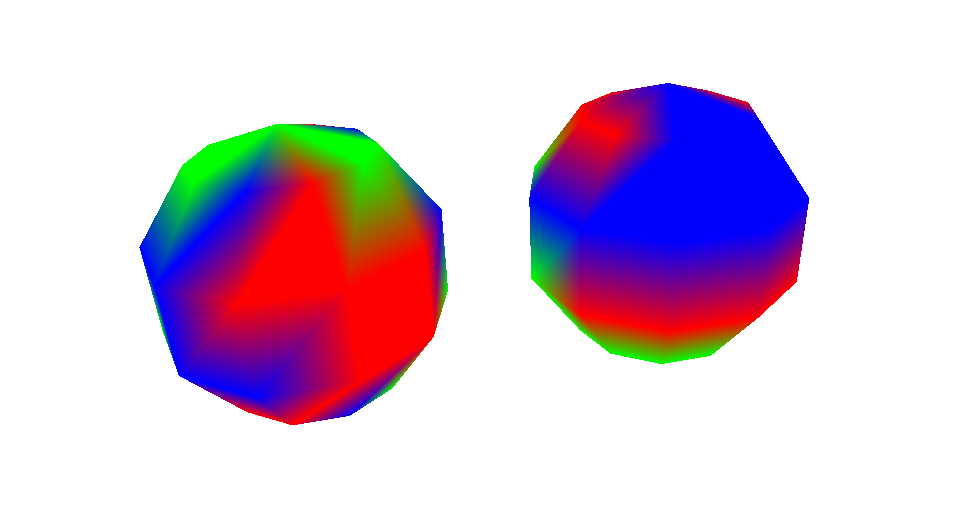
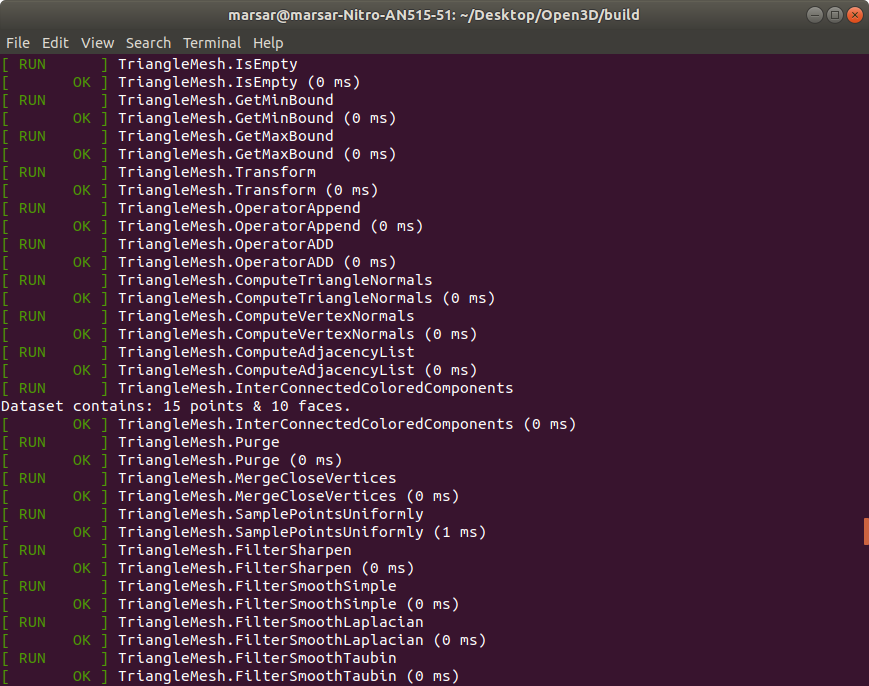
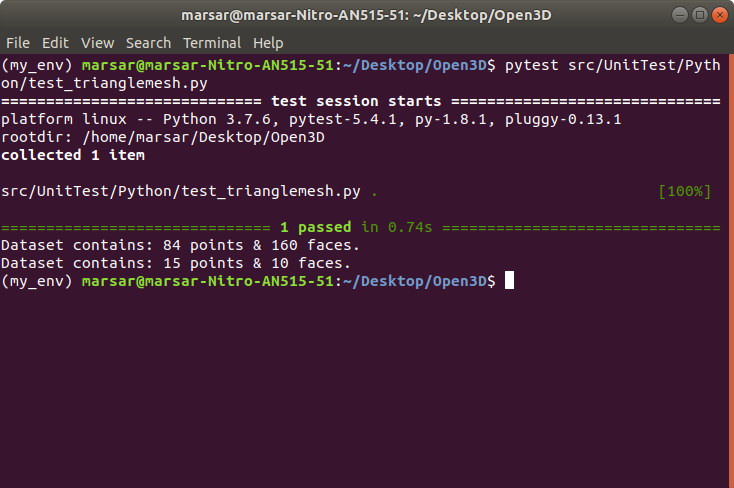

<p align="center">

</p>

# Open3D Introduction [](https://travis-ci.org/badges/badgerbadgerbadger)

<h5>
Table of Content

	1. Introduction

	2. Instructions to execute

	3. Results
</h5>


## 1. Introduction

Made following changes to the Open3D repository:

- [x] Implemented C++ Function *open3d::geometry::TriangleMesh::IdenticallyColoredConnectedComponents*
- [x] Implemented Python binding for *open3d.geometry.TriangleMesh.identically_colored_connected_components*
- [x] Created *Solution.cpp* and executable*(Solution)* for testing the function.
- [x] Created *Solution.py* to test python binding for the function.
- [x] Wrote results to *Results.txt.*
- [x] Created and tested C++ unit tests.
- [x] Created and tested Python unit tests.
- [x] Provided documentation for code, build/run instructions and background about the algorithm used.

## 2. Instructions to execute & test assessment
1. Clone this repository and extract installation folder in a directory *(I have extracted on my Desktop)*.  
` Move the content of downloaded folder *IntelProgrammingAssessment* on the desktop. So now on your desktop you should see Open3D folder`  
2. Activate a virtual env(not necessary, but a better approach as given on forums)  
`cd ~/Desktop/Open3D`  
`conda activate my_env`  
3. Install dependencies  
`util/scripts/install-deps-ubuntu.sh`  
4. Create and navigate to build folder  
`mkdir build`  
`cd build`  
5. Configure  
```cmake -DPYTHON_EXECUTABLE=`which python` ..```  
6. Make the project (takes around 5-8 minutes)  
`make all -j$(nproc)`  
7. Create and Install the Open3D python package  
`make install-pip-package`  
8. Lookup executable locations on your system(Optional)  
`find . -executable -type f`  
9. Run the C++ executable *(Solution)*  
`cd ..`  
`./build/bin/examples/Solution`  
Result.txt will be inside the examples/TestData folder.  
10. Run Python Solution.py  
`python examples/Python/Basic/Solution.py`  
11. Run C++ UnitTests executable *(includes test for TriangleMesh::IdenticallyColoredConnectedComponents)*  
`./build/bin/unitTests`  
12. Run Python test  
`pytest src/UnitTest/Python/test_trianglemesh.py`  

I realized Open3D makes it easier to work on 3D datasets.



To navigate node graph, we can use any traversal algorithm. I chose Breadth-First-Search Algorithm. I have kept the code resuable and implemented BFS as a separate private function. Optionally, depending upon the dataset nature, we can switch to various algorithms like DFS, BFS etc. supporting our case.

Here are the following results I got:

1. [Result](Open3D/examples/TestData/Results.txt)  

2. C++ Unit Test result *(All 233 tests run together, so including testcase for implemented function)*  

  

3. Pytest for testing python binding.  



*Note: I found issues while building unitTests due to library_linkage errors in CMakeLists.txt. I modified google_test CMakeLists.txt to include the correct libraries. Also, I have set the BUILD_UNIT_TEST flag ON in project CMakeList.txt for faster debugging.*

## 3. Results
BFS works correctly to find the interconnected nodes. We get multiple chains, for each color. If the dataset is disjoint, as in this case, we get multiple long chains for each color. For the sake of consistency with the output format described in the problem set, I have restricted the output to largest chains among each color among all the disjoint sets in the dataset.


## Supported OSes and compilers

* Ubuntu 18.04: GCC 5.x or newer
